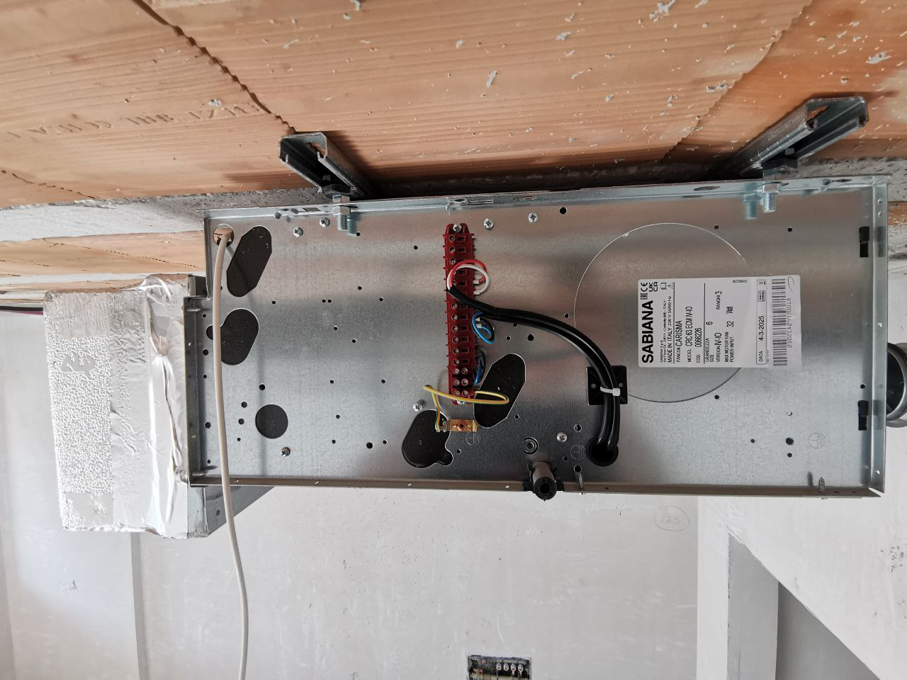

# Ceiling-Fan-Coil-HVAC---Connection-Sabiana

This is a field log for connecting a Sabiana ceiling fan coil cassette (model shown in the photo). The connection must be strictly performed according to the factory diagram for a specific model and site conditions. Below is what I did on site, plus a general overview of the connection for similar units. This is not a universal diagram.

