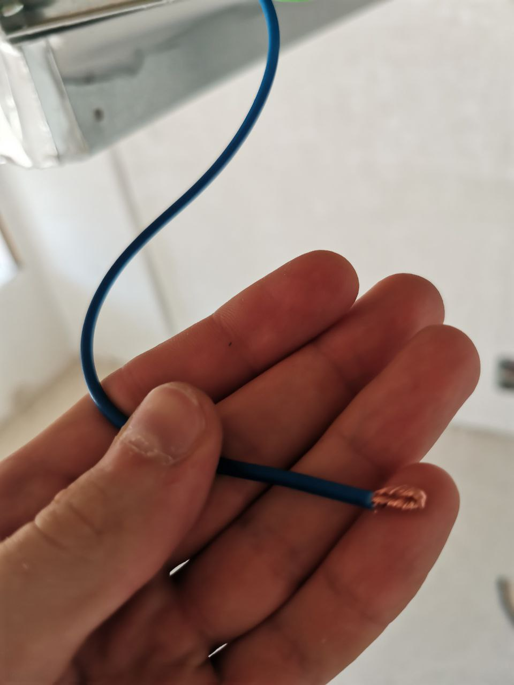
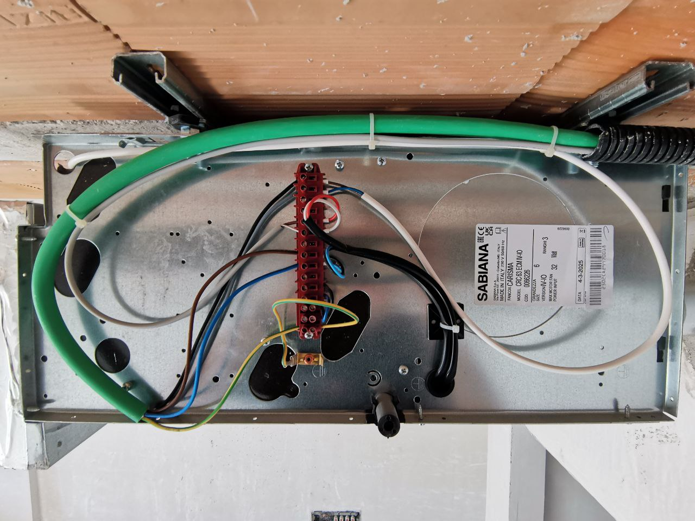

# Ceiling-Fan-Coil-HVAC---Connection-Sabiana

This is a field log for connecting a Sabiana ceiling fan coil cassette (model shown in the photo). The connection must be strictly performed according to the factory diagram for a specific model and site conditions. Below is what I did on site, plus a general overview of the connection for similar units. This is not a universal diagram.

🧰 Tools
Electrician's scissors
Flathead screwdriver
Phillips screwdriver
Cable ties

Twisting cables for connection with a bend

⚡ Electrical connections (what I did)

Work was done without power

Main power: supplied L and N to the block

Electromagnetic valve: connected a pair of wires to the corresponding terminals (usually marked as VALVE/VALV or goes through a relay, look in the manual for accuracy since I did not have the inscriptions). Fixed (in my case it was a white cable).

Connected the ground

Check: tightened all the screws.

Final connection result

